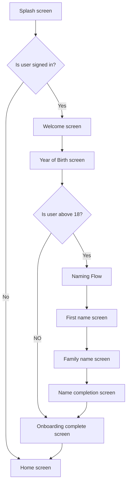

# Navigation Stack and resuable flow example

## Introduction

| Tool           |             Version |
| :------------- | ------------------: |
| Xcode          |              15.2 |
| iOS Target     |              16.0.0 |
| Swift          |               5.9.0 |

This repostory shows an example of one of the possible ways of creating re-usable flows of screen. The project was created using The Composable Architecture (more info on TCA [here](https://github.com/pointfreeco/swift-composable-architecture)).

If user is above 18, they have an option to updat their name. This reuses the naming flow.

https://github.com/Muhammed9991/TCANavigationStackExample/assets/80204376/e64be960-bfac-4893-94bd-5f32d07738d8

